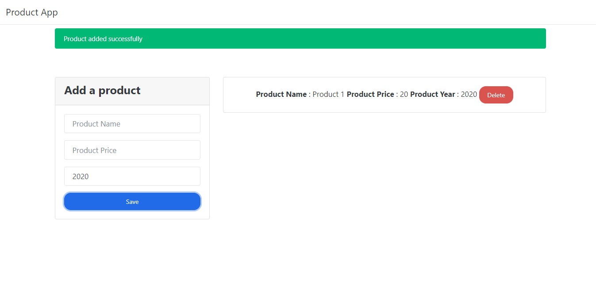

# App con JS y POO
Aplicación usando JavaScript con POO.

Tecnologías:
- Js.
- html.
- Bootstrap 4.4.1

Esta app puede:
- Productos: Crear/Eliminar.

# Screenshot

# Guía de instalación
1. Descarga el repositorio.
2. Descomprime la carpeta dentro del directorio que desees.
3. Renombra la carpeta (Opcional).
4. Abre la aplicación en el navegador con `tu-directorio/index.html.`.
5. Ya puedes comenzar a utilizar la aplicación.
# License

#### Todos los proyectos creados por Alex Ku Dzul están bajo la [licencia MIT](https://opensource.org/licenses/MIT).